# Awesome UI Patterns
A collection of UI patterns that are 😎 awesome / beautiful.

## Sources
Web sites that aggregate good design.

- [Collect UI](http://collectui.com/)
- [CodePen](https://codepen.io/)
- [CSS Nector](https://cssnectar.com/)
- [Behance](https://www.behance.net)
- [Pttrns](https://pttrns.com/)
- [Dribbble](https://dribbble.com/)

## Elements
Individual UI element examples that are really impressive. Can be live code snippets or designs.

### Accordians

#### [CSS Accordian](https://codepen.io/mxttsco/pen/EgAVjo)

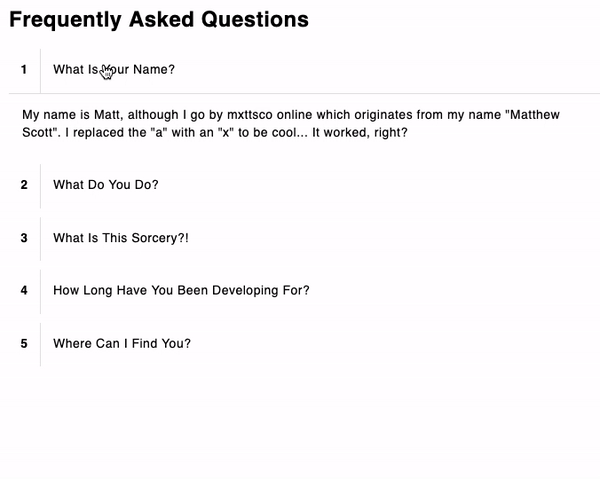

#### [CSS Accordian #2](https://codepen.io/villa7/pen/grPddp)

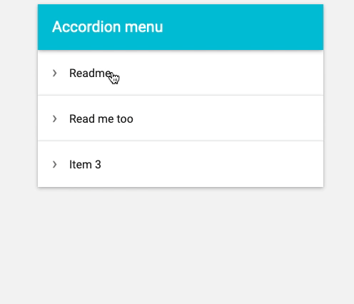

#### [CSS + HTML only Accordion Element](https://codepen.io/abergin/pen/ihlDf)

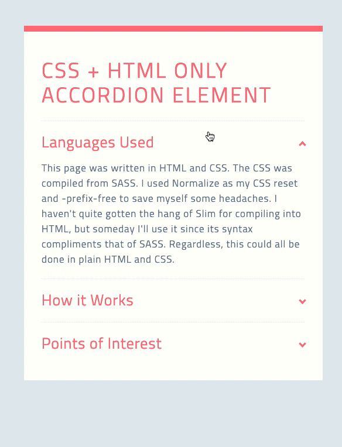

#### [Accordian](https://codepen.io/valaxin/pen/reQMXp)

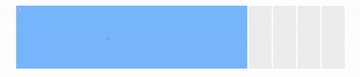

### Buttons

#### [Trash button animation](https://codepen.io/aaroniker/pen/BaNzEWe)

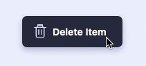

### Checkboxes

#### [Checklist Animation](https://codepen.io/milanraring/pen/QWbqBGo)

#### [Pure CSS toggle buttons](https://codepen.io/mallendeo/pen/eLIiG)

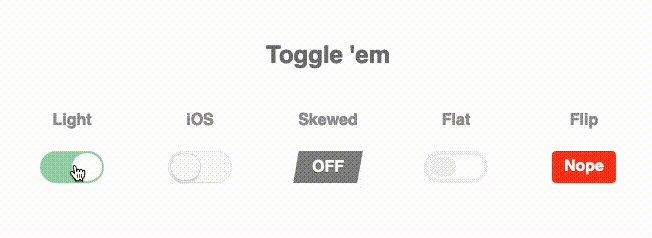

### Cards

#### [Hover Card Interactions](https://codepen.io/hexagoncircle/pen/XWbWKwL)

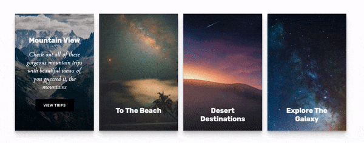

## Sites / Apps
Examples of web applications in the wild that really nail some aspect of their UI/UX.

### Coming soon...

## Designs

### Sign Up/In Forms

#### [Sign Up and Login Animated](https://dribbble.com/shots/2311260-Day-1-Sign-Up-and-Login-Animated-Download-Template)

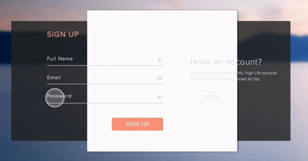

#### [Task Manager Concept Sign Up](https://dribbble.com/shots/2878911-To-Do-App-Concept-Sign-Up)

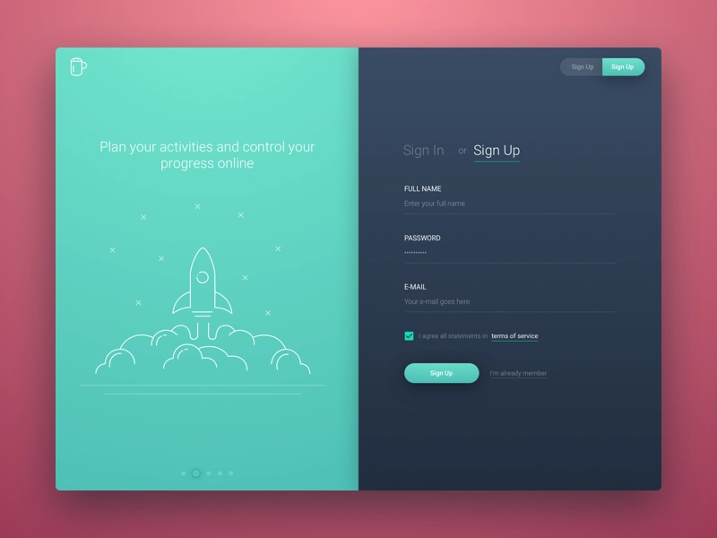

#### [Game Login](https://dribbble.com/shots/2358349-Daily-Shmaily-UI-1-Game-Login)

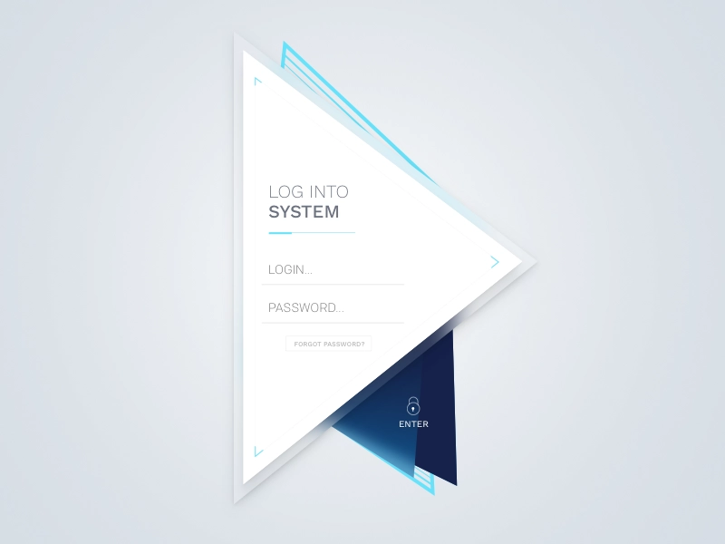

#### [Sign Up Window](https://dribbble.com/shots/2404873-Sign-Up-Window-Daily-UI-001)

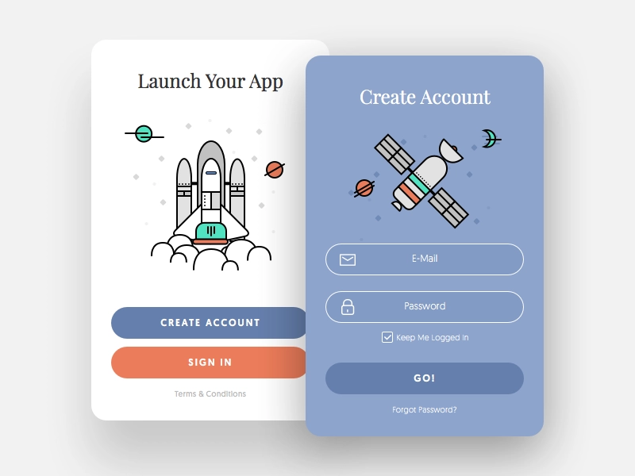

## Libraries
Pre-built libraries that are ready to use.

### CSS Frameworks

#### [Tailwind CSS](https://www.youtube.com/watch?v=mCa0JXEwDEk)

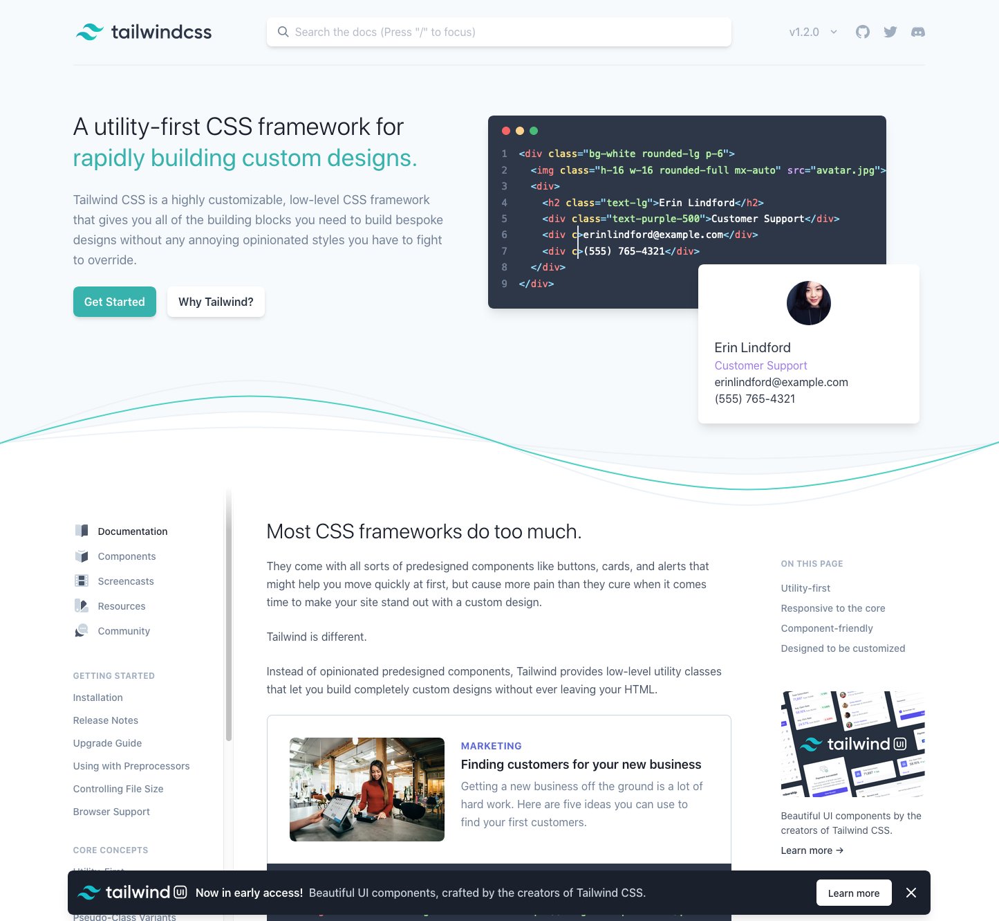

#### [Materialize CSS](https://materializecss.com/)

#### [Bootstrap](https://getbootstrap.com/)

#### [BOOTSTRA.386](https://github.com/kristopolous/BOOTSTRA.386)

#### [Terminal CSS](https://github.com/Gioni06/terminal.css)

#### [PaperCSS](https://github.com/papercss/papercss)

#### [RPGUI](https://github.com/RonenNess/RPGUI)

#### [Geo-Bootstrap](https://github.com/divshot/geo-bootstrap)

#### [XP.css](https://botoxparty.github.io/XP.css/)

![images/libraries/xp-css.png]

### React Component Libraries

#### [React95](https://github.com/React95/React95)

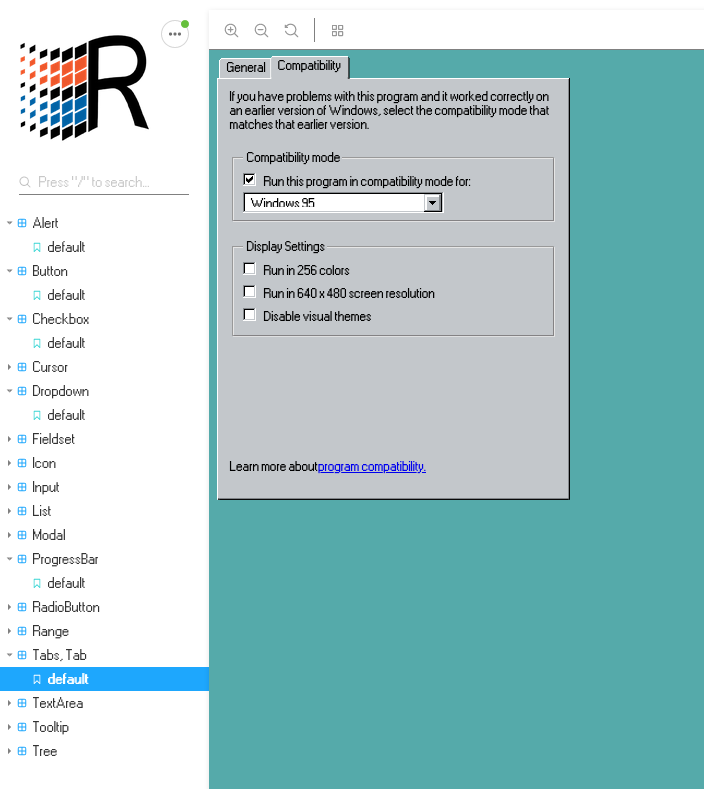

## CSS Framework Resources

### Tailwind

#### [Tailwind Blocks](https://mert.dev/tailwind-blocks/)

#### [Awesome Tailwind CSS](https://github.com/aniftyco/awesome-tailwindcss)
